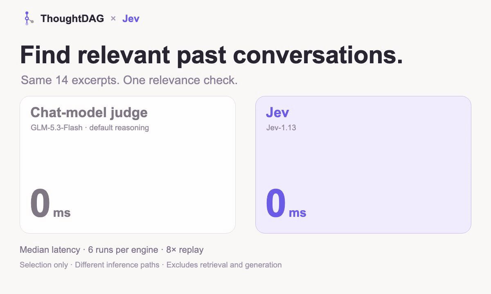

<div align="center">


# ThoughtDAG

**AI conversations that branch on an infinite canvas.**

Each exchange becomes a node. **Wires are the context.**<br/>
Explore a side question, connect useful paths, and choose what the model sees next.

[Download](https://chenxiachan.github.io/thoughtdag/#download) · [Website](https://chenxiachan.github.io/thoughtdag/) · [Docs](https://chenxiachan.github.io/thoughtdag/docs/) · [中文](./README_ZH.md)


</div>

[0.5 update](#new-in-05--thoughtdag--jev) · [CLI](#find-past-context-from-the-command-line) · [Harness](#inside-deepseek-harness) · [Desktop](#the-desktop-app) · [How it works](#the-one-rule) · [How it differs](#how-thoughtdag-differs) · [Research](#-research-why-editable-context-matters)

## New in 0.5 · ThoughtDAG × Jev

**Bring relevant past conversations into the question you are asking now.**

- **Find earlier work.** The local index searches supported agent sessions and ThoughtDAG canvases. Topic dossiers collect decisions and open questions with links back to their sources.
- **Select what belongs.** The optional **Jev decision layer** helps identify topics and rank relevant excerpts. Your chosen language model develops the answer.
- **Check what comes back.** With recall enabled, the context panel lists the dossiers and excerpts added to a request. Inspect their sources or exclude individual items before continuing.



In a small relevance-selection pilot, Jev's median was **391 ms** versus **24,813 ms** for our GLM adapter. These are selection-stage timings, not end-to-end search or answer times.

<details>
<summary>What the timing measures</summary>

Six runs per engine over the same 14 synthetic excerpts. Median selection latency: **391 ms** for Jev-1.13 and **24,813 ms** for the GLM-5.3-Flash adapter with default reasoning. These are different inference paths, not a controlled ranking of model speed. Retrieval and answer generation are excluded; this does not measure whole-product speed or accuracy gains.

Without a decision model, recall falls back to rules. The **System 1 / System 2-style split** describes software roles here: quick relevance decisions, then answer and dossier generation. It is not a claim about human cognition.

</details>

[Set up history and recall](https://chenxiachan.github.io/thoughtdag/docs/guides/memory) · [Configure Jev](https://chenxiachan.github.io/thoughtdag/docs/setup#decision-model)

## Find past context from the command line

Remember a file, a phrase or a URL, but not the session? Search local conversations and jump to the matching turn, without opening the desktop app.

```bash
npx thoughtdag why src/lib/api.ts           # conversations about this file
npx thoughtdag find "a phrase you remember" # matching conversation turns
npx thoughtdag topics                       # topics in your local index
```

For regular use: `npm install -g thoughtdag`. Run `thoughtdag setup mcp` to expose read-only history tools to your agent. Retrieve the relevant turns rather than replaying a whole session. [CLI guide →](cli/README.md)

## Inside DeepSeek Harness

Switch between chat and ThoughtDAG's graph inside the harness. Choose the context on the canvas; the harness runs the next turn.

```bash
dsh plugin --profile web add dsh-thoughtdag
dsh web
```

The plugin bundles the canvas and memory layer. Requires Node 22.19+ (22.x) or 24+, and DeepSeek Harness 0.1.2-rc.1 or later. [Plugin guide →](https://chenxiachan.github.io/thoughtdag/docs/guides/deepseek-harness)


## The desktop app

Read a document beside your conversation, branch from a passage, and connect the paths you want to explore together. Use your own model connection.

```bash
brew install --cask thoughtdag
```

Or [download for macOS, Windows or Linux](https://chenxiachan.github.io/thoughtdag/#download), connect a model and open the example canvas.


<p align="center"><a href="https://www.youtube.com/watch?v=-8BqAyaoNXQ"></a></p>

<p align="center"><a href="https://www.youtube.com/watch?v=-8BqAyaoNXQ">▶ Watch the 33-second tour</a></p>

## The one rule

> **Wires are the context.** Connect conversation paths to use them in the next question. Disconnect a path without deleting the work.

Branch from a detail, explore it separately, then connect the useful parts to a later question. The graph changes the model's input, not just the layout.

**Preview what the model will receive before sending.** Wires select the conversation paths; explicit references and enabled recall can add material alongside them. [Context guide →](https://chenxiachan.github.io/thoughtdag/docs/guides/context-control)

## In action

<table><tr>
<td width="45%"></td>
<td width="55%">

### ✂️ Change the context, keep the exploration

Select text in an answer to start a side branch. Disconnect that branch from a later question, then regenerate to compare. Its nodes stay on the canvas: keep exploring from them or reconnect them later.

</td></tr></table>

<table><tr><td width="55%">

### 📖 Read, clip, and ask

Open a PDF, image or HTML alongside the graph. Ask about a passage or clip a figure into its own node. PDF clips keep their page reference, so you can check the source as the discussion develops.

</td>
<td width="45%"></td>
</tr></table>

<table><tr>
<td width="45%"></td>
<td width="55%">

### 💎 Condense the path; weave the highlights

**Condense** creates a shorter copy of a conversation path while preserving the original. **Weave** turns selected highlights into cited prose. Continue from the result, or export it as Markdown. Zooming out changes the view, not the context.

</td></tr></table>

<table><tr><td width="55%">

### 🧭 Session Atlas: continue an earlier conversation

Open a supported local agent session as a graph. Pick where to branch or continue; use the history index to find related discussions from other sessions. Atlas provides the view, and recall helps find what to bring in.

*Supports local Claude Code, Codex, DeepSeek Harness and Pi sessions. Source sessions remain read-only.*

</td>
<td width="45%"></td>
</tr></table>

## How ThoughtDAG differs

Nodes and edges serve different purposes. Here is where ThoughtDAG fits:

| Product category | ThoughtDAG's focus |
|---|---|
| Linear chat | Keep several lines of inquiry visible and choose which ones continue into the next question. |
| Mind maps and whiteboards | Use connections to change model input, not just organize ideas visually. |
| Branching chat canvases | Connect several branches into one question, or disconnect a path while keeping its nodes. |
| Agent workflow canvases | Edit conversational context as you explore, rather than design a pipeline of automated tasks. |
| Retrieval and automatic memory | Inspect source-linked dossiers and recalled excerpts; edit or exclude what the next request uses. |
| Code graphs and conversation search | Find the discussions behind a file or topic across supported agents, then continue from them. |
| Harness context viewers | Move from inspecting a session to composing and sending its next turn. |

These categories overlap; individual tools may share capabilities. ThoughtDAG is not an autonomous research agent or a replacement for your coding harness. Retrieval can miss relevant history, and generated dossiers still need checking.

## 🗺️ Export the shape of your thinking

Export the canvas as a Thought Map: nodes, wires and structural counts, without the full conversation text. Use it to share how an investigation branched, narrowed and came together.


## More ways to run

### Run from source

```bash
npm install
npm run server    # LLM proxy :3001
npm run dev       # frontend :5173
```

Configure a model in the app or through environment variables. [Local setup →](docs/setup.md)

### Browser demo

The [browser demo](https://app.thoughtdag.workers.dev) includes an example canvas that needs no API key. It is a subset: local session discovery, Session Atlas and the local history/memory layer require desktop or local hosting.

## 🧪 Research: Why editable context matters

### Context Intervention Benchmark · Pilot v2

`9 model endpoints` · `1,485 scored responses` · `exact-match scoring`

Deleting a wrong claim may leave its consequences in later replies. In our synthetic pilot, removing the source alone repaired **152 of 162** affected model-cases; removing the contaminated subgraph repaired **162**, and recomputing descendants repaired **161**. The report includes the protocol, results and limitations. This is a context-intervention experiment, not a general model leaderboard.

[Read the case study](https://chenxiachan.github.io/thoughtdag/stories/context-repair/) · [Methods and results](https://chenxiachan.github.io/thoughtdag/research/context-repair-pilot-v2/) · [Suggest a model](https://github.com/chenxiachan/thoughtdag/issues/new?template=suggest-next-model.yml)

## More capabilities

| Capability | What it adds to the same workflow |
|---|---|
| Request preview | Check the conversation, references and recalled material assembled for the next call. |
| Staleness and replay | Review dependent answers after an upstream edit; rerun in dependency order. |
| Per-node model selection | Try a different model on a branch without changing the entire canvas. |
| Read-only sharing | Share a graph for others to inspect; preview its contents before publishing. |
| Folder backup | Save canvases as local files and keep a recoverable copy outside browser storage. |

[Full capabilities and roadmap →](docs/features.md)

## Models, cost & privacy

Canvases, documents, the index and dossiers are stored locally. **Remote model calls send relevant content to your configured providers**, including decision and dossier-generation calls. Provider charges may apply; disabling Jev does not disable ordinary model calls.

Connect local Ollama or an OpenAI-compatible endpoint. Inside DeepSeek Harness, inference uses the harness's providers and keys. Export backups and Markdown, and review text and metadata before sharing. [Setup and privacy details →](docs/setup.md)

## Contributors

<a href="https://github.com/KehanLiu" title="@KehanLiu"></a>
<a href="https://github.com/nasodaengineer" title="@nasodaengineer"></a>
<a href="https://github.com/hexu321" title="@hexu321"></a>
<a href="https://github.com/Moya-Doc" title="@Moya-Doc"></a>
<a href="https://github.com/nanami-0713" title="@nanami-0713"></a>
<a href="https://github.com/LHN-xiao-hai-tun" title="@LHN-xiao-hai-tun"></a>
<a href="https://github.com/HarveyZed" title="@HarveyZed"></a>

Contributions are welcome — start with [CONTRIBUTING.md](./CONTRIBUTING.md).

## Supporters

With gratitude to **@andreilaiter**, ThoughtDAG's first supporter, and to everyone helping this independent open-source project grow.

<a href="https://buymeacoffee.com/chatchan92"></a>

---

<div align="center">

[MIT](./LICENSE) © 2026 Xia Chen · [Roadmap](docs/features.md#roadmap) · [Feedback](https://github.com/chenxiachan/thoughtdag/issues) · [Cite](https://github.com/chenxiachan/thoughtdag#cite-this-repository)

</div>
